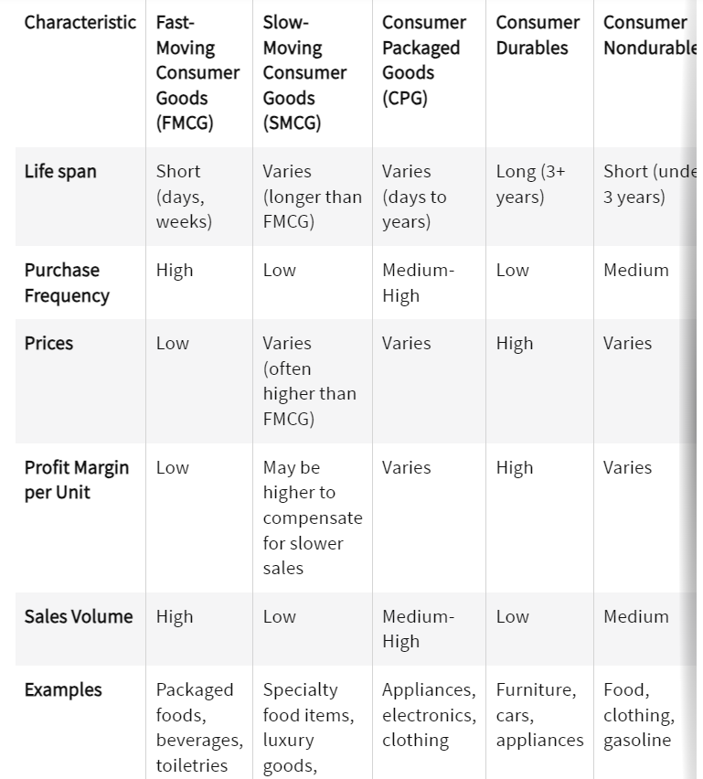

# hackology_golem

* szukamy wartości dla producenta
* FMCG -> fast moving consumer goods (czyli dawna nazwa dla connectora) - tl;dr co to jest?

## avenues  
- [ ] model przewidywania szeregu czasowego
    * krótki horyzon czasowy
    * z podziałem na kategorie / produkty / geograficznie / na sklepy 
    * pytanie - jak bardzo w przeszłość patrzymy
    * mądre dodatki -> typu fancy XAI (shap), kwantyle, centyle, decyle, etc.
    * dane z walmartu [kaggle link](https://www.kaggle.com/competitions/m5-forecasting-accuracy/data) - raczej
- [ ] analiza zależności w danych (statystyczny ML)
    * wnioski długofalowe, typu korelacja z kalendarzem, pogodą, etc.
- [ ] jakiś UI typu gradio
- [ ] llm chatbot, który będzie sobie rozmawiał z użytkownikiem
- [ ] side-quest z cleanlabem
